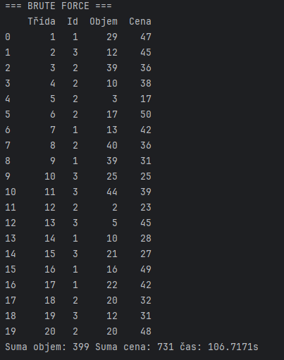

# Porovnání heuristiky Simulated Annealing s Brute Force u problému batohu s vícenásobnou volbou

## Úvod

Cílem tohoto projektu je řešení problému batohu s vícenásobnou volbou (Multiple Choice Knapsack Problem – MCKP) pomocí
heuristiky **Simulated Annealing (SA)** a její porovnání s exaktním řešením pomocí **brute force** algoritmu.

Výsledky jsou dále vizualizovány formou grafu a vypsány do přehledných tabulek.

---

## 1. Reprezentace řešení

Jednotlivé řešení (tzv. jedinec) je reprezentováno jako **vektor indexů**, kde každý prvek určuje, který item byl zvolen
z dané třídy:

- Příklad: `[1, 0, 2, 1, 1, 2, ...]` – délka vektoru odpovídá počtu tříd
- Hodnota `1` na pozici `0` znamená, že z první třídy byl vybrán druhý item (indexování od nuly)

---

## 2. Účelová (fitness) funkce

Účelová funkce hodnotí kombinaci itemů podle jejich **celkové hodnoty**. Zároveň zajišťuje, že kombinace nepřekračuje *
*maximální kapacitu batohu**. Pokud ano, je ohodnocena jako **neplatná**.

---

## 3. Generování sousedního řešení

Funkce generující sousedy funguje následovně:

- Pro každou třídu s pravděpodobností `p = 1 / dimenze` zvolíme **jiný** item (náhodně)
- Tímto způsobem se zaručí malé změny v řešení, ale zároveň různost
- Změna je **zakázána na původní hodnotu**, aby soused nebyl shodný

---

## 4. Konvergenční graf

Níže je graf, který ukazuje průběh nejlepší nalezené hodnoty během ohodnocování v SA. Červená čára ukazuje optimální
hodnotu nalezenou brute force algoritmem.

---

## 5. Porovnání výsledků

### Brute Force řešení

- Hledá všechna možná řešení vyčerpávajícím způsobem
- Vhodné pro malé instance
- Výpočetní čas: **106.7171 s**
- Hodnota: **731**

---

### Simulated Annealing

- Heuristická metoda, která připouští i zhoršení řešení
- Vhodná pro větší instance
- Výpočetní čas: **0.0747 s**
- Hodnota: **702**

---

### Procentuální úspěšnost

**SA dosáhlo 96.03 % optimální hodnoty při řádově kratším výpočetním čase.**

---

## Závěr

Heuristika **Simulated Annealing** poskytuje velmi dobré výsledky v krátkém čase, i když není zaručeno, že vždy najde
globální optimum.
