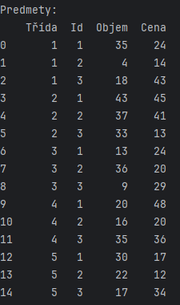
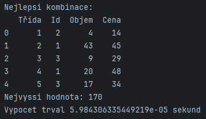
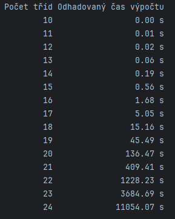
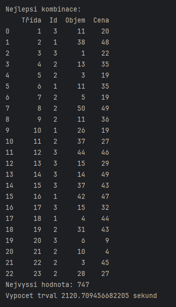
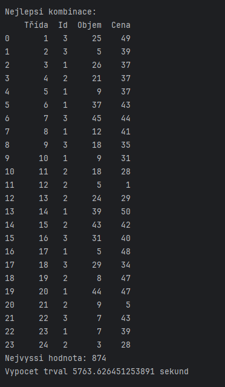

# Protokol – Problém batohu s vícenásobnou volbou (MCKP)

## Parametry

- Počet tříd: **5**
- Počet předmětů v každé třídě: **3**
- Maximální kapacita batohu: `20 × 5 = 100`

---

## Seznam všech vygenerovaných předmětů

Každý předmět je reprezentován jako `(Třída, ID, Objem, Cena)`.  
Bylo náhodně vygenerováno 15 předmětů.

---

## Nejlepší nalezené řešení

Z každé třídy byl vybrán právě jeden předmět tak, aby součet jejich objemů nepřesáhl kapacitu batohu a celková cena byla
maximální.

- **Celková cena:** `160`
- **Celkový objem:** `≤ 100`
- **Podmínky byly splněny.**

---

## Výpočetní čas

- **Doba výpočtu nejlepší kombinace (brute-force):** `0.000064 s`

---

## Kolik kombinací existuje pro libovolný počet tříd?

Každá třída obsahuje 3 předměty a z každé třídy se vybírá právě jeden předmět.  
Počet všech možných kombinací pro `n` tříd:

| Počet tříd | Počet kombinací |
|------------|-----------------|
| 5          | 243             |
| 10         | 59,049          |
| 15         | 14,348,907      |
| 20         | 3,486,784,401   |
| 25         | 847,288,609,443 |

---

### Odhadovaný čas výpočtu dle počtu tříd

Na základě měření s 20 třídami (čas 136.47 s) jsme vypočítali přibližné časy pro blízké hodnoty `n`.  
Výpočetní čas roste exponenciálně – trojnásobně s každou přidanou třídou.

---

## Vlastní měření pro vyšší počty tříd

Na svém stroji jsem reálně otestoval 22 a 23 tříd. Výsledky jsou následující:

- **22 tříd**
    - Výpočetní čas: `2120.71 s` (≈ **35,3 min**)
    - Nejvyšší hodnota: `747`
    - Kombinací: `3^22 = 3 104 850 532`
    - Výpočet byl úspěšný a **vešel se do jedné hodiny**.

  

- **23 tříd**
    - Výpočetní čas: `5763.63 s` (≈ **96,1 min**)
    - Nejvyšší hodnota: `874`
    - Kombinací: `3^23 = 9 314 551 596`
    - Výpočet byl úspěšný, ale **už přesáhl 1 hodinu**.

  

---

### 🧠 Závěr:

Na mém stroji lze metodou hrubé síly vypočítat problém batohu s vícenásobnou volbou maximálně pro 22 tříd do jedné
hodiny. Pro větší počet tříd už výpočetní čas výrazně překračuje prakticky využitelný limit.