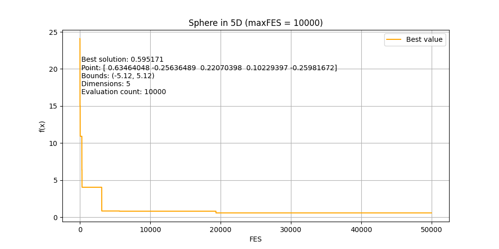
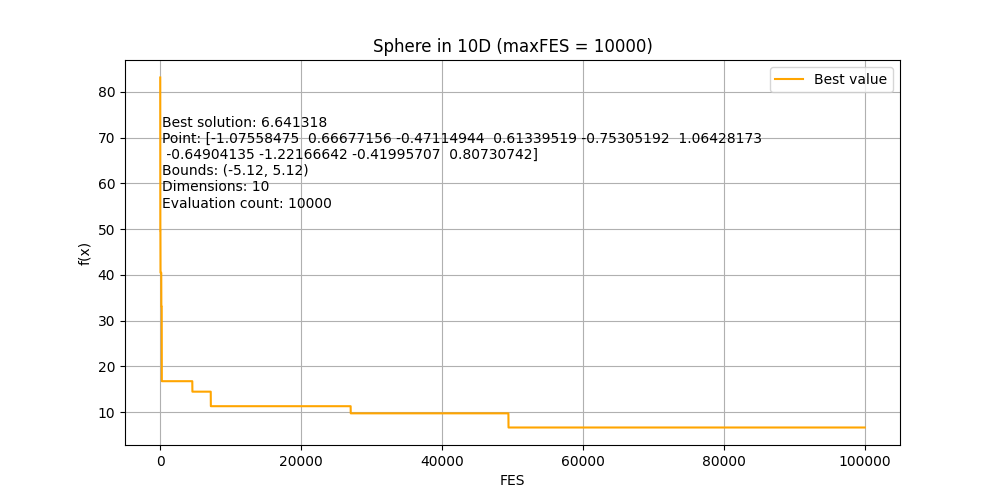
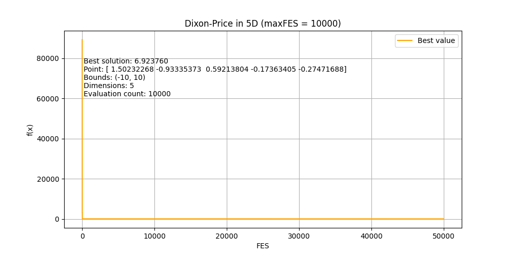
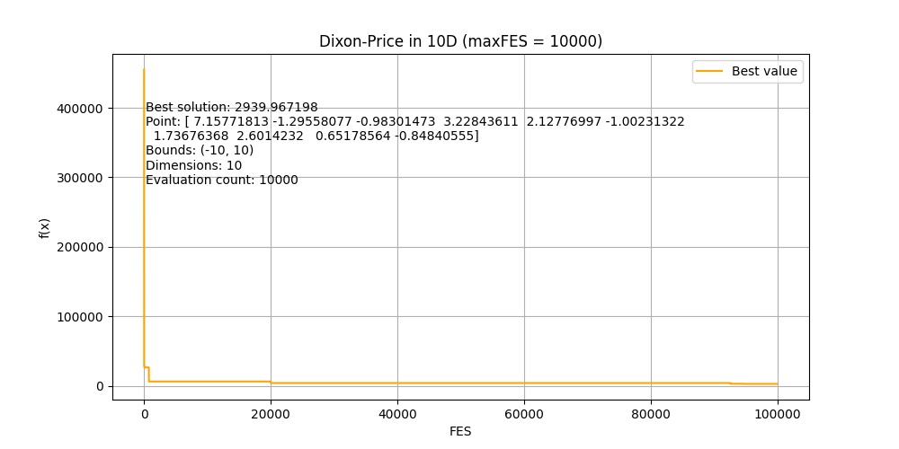
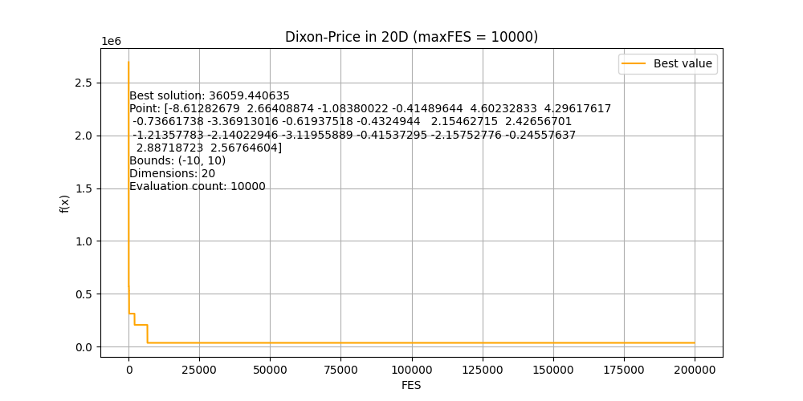
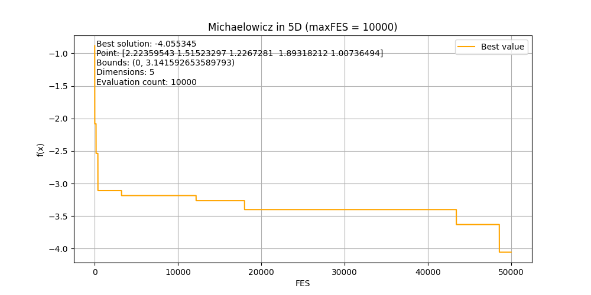
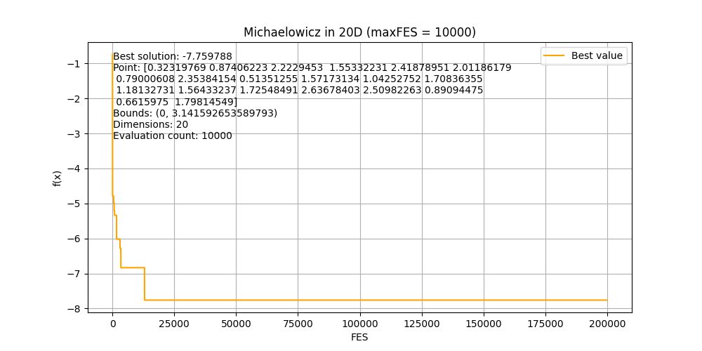
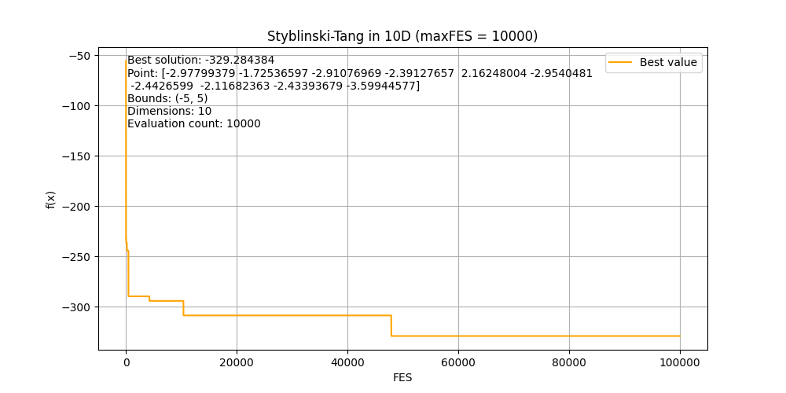
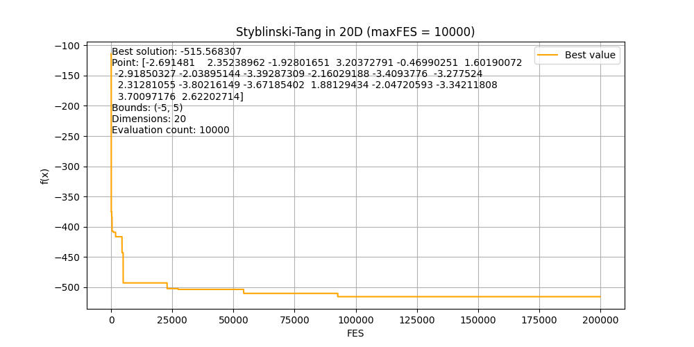
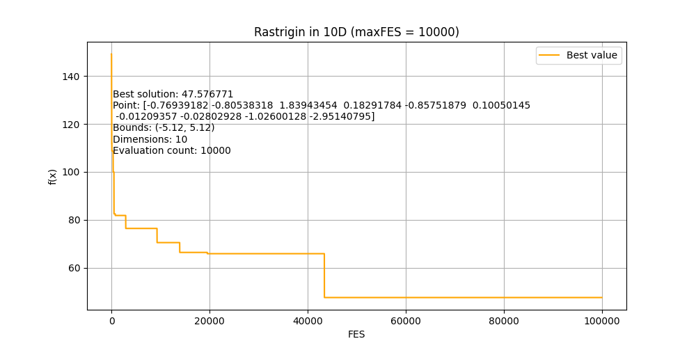

# Analýza optimalizačních funkcí pomocí náhodného prohledávání

Tento projekt implementuje optimalizační algoritmus **náhodného prohledávání** pro různé testovací funkce.  
Výsledky jsou vizualizovány pomocí grafů zobrazujících konvergenci algoritmu.

## **Použité optimalizační funkce**

Optimalizujeme následující funkce:

- **Sphere Function**
- **Dixon-Price Function**
- **Michaelowicz Function**
- **Styblinski-Tang Function**
- **Rastrigin Function**

Každá z funkcí je testována ve třech dimenzích: **5D, 10D a 20D**.

## **Struktura kódu**

Hlavní soubor **`main.py`** obsahuje:

- Implementaci optimalizačních funkcí
- Náhodný vyhledávací algoritmus
- Ukládání a vizualizaci výsledků pomocí knihovny `matplotlib`

## **Výstupy**

Každý běh algoritmu generuje konvergenční grafy v adresáři `charts/`, pojmenované podle formátu:

Níže jsou ukázky výsledků pro různé dimenze:

### **Sphere Function**

#### **5D**

#### **10D**

#### **20D**

### **Dixon-Price Function**

#### **5D**

#### **10D**

#### **20D**

---

### **Michaelowicz Function**

#### **5D**

#### **10D**

#### **20D**

---

### **Styblinski-Tang Function**

#### **5D**

#### **10D**

#### **20D**

---

### **Rastrigin Function**

#### **5D**

#### **10D**

#### **20D**

